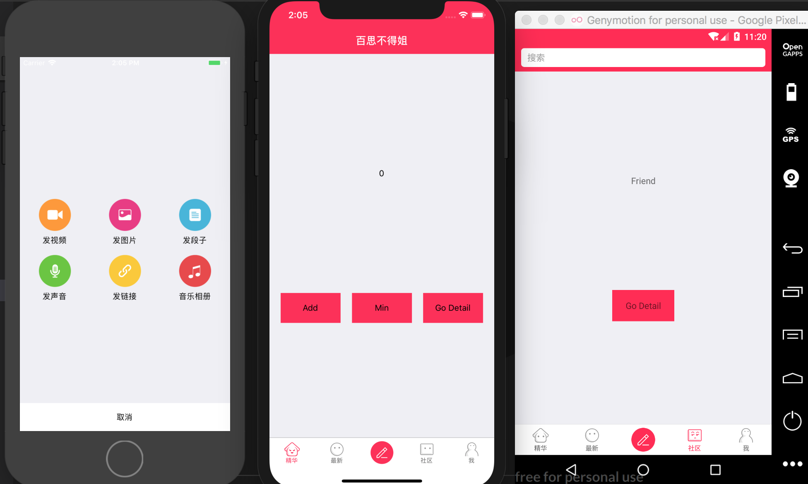
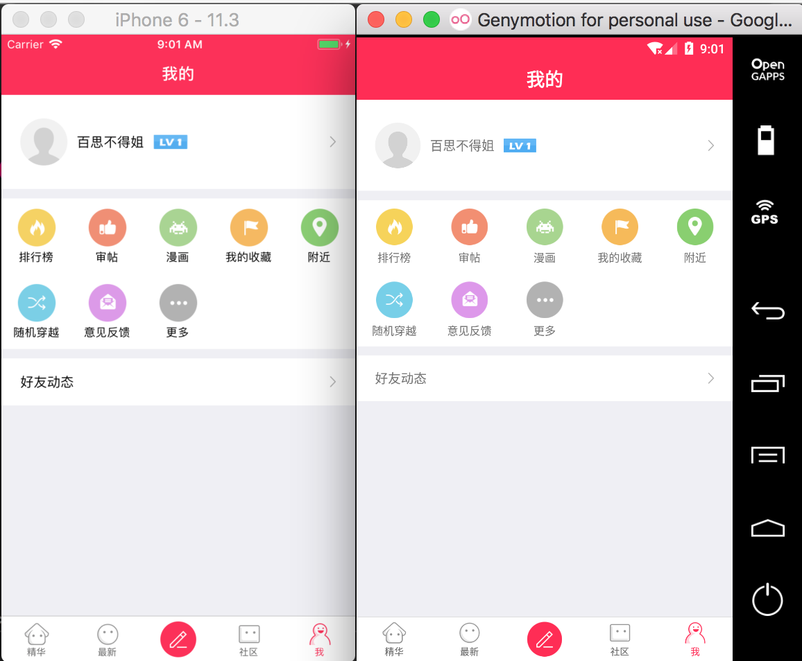
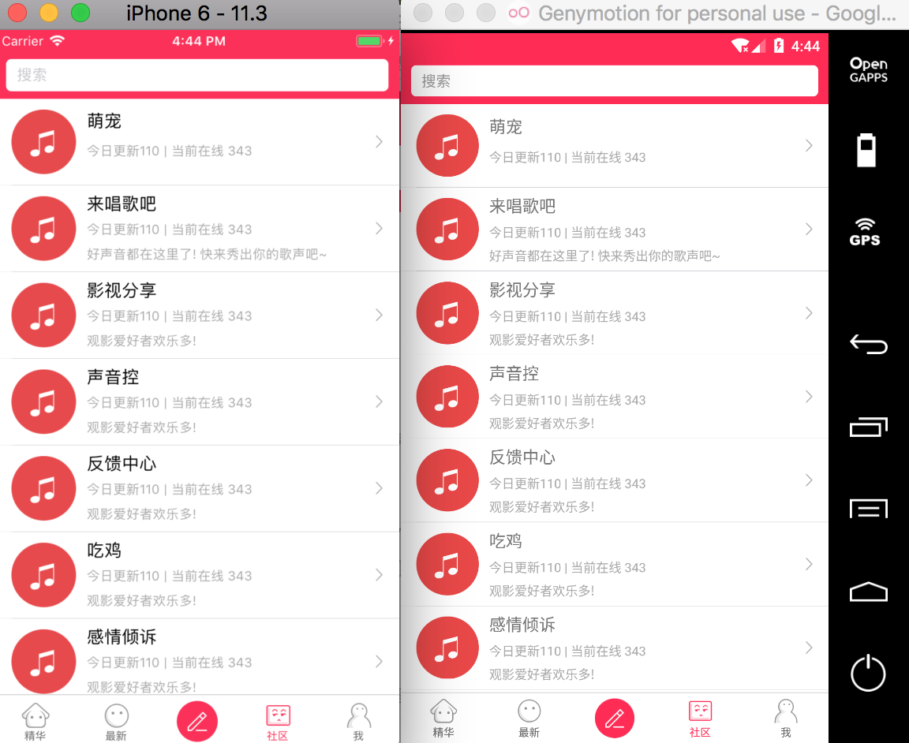
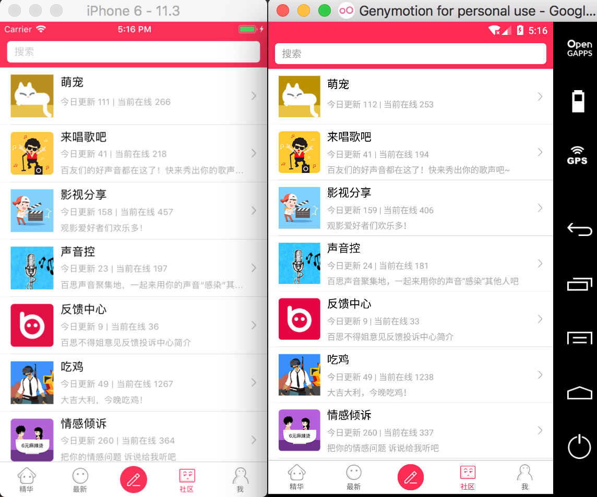
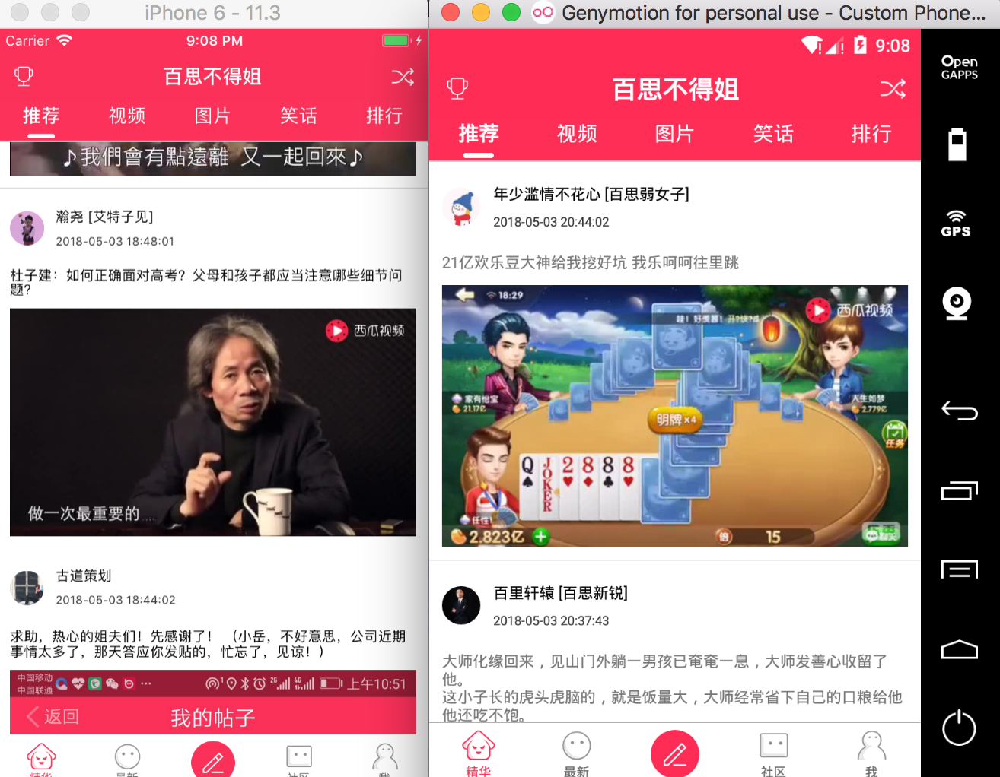

# Misses
百思不得姐仿写
react native
项目开始时间2018.4.25.
项目仅在工作业余时间开发,所以进度可能会比较慢...

4.25
* 初始化项目
* 基础项目框架搭建
* react-navigation + redux

4.26
* 基础项目优化
* 统一安卓和iOS样式,适配iPhoneX
* 安卓状态栏沉浸,标题栏居中
* 发布界面基本布局

4.27
* 基础项目优化
* 我的界面基本布局

4.28
* 基础项目优化
* 社区界面基本布局

5.2
* 基础项目优化
* 设置默认导航返回按钮
* 社区界面网络接口调用

5.3
* 基础项目优化
* 首页基本布局
* 首页推荐接口调用

